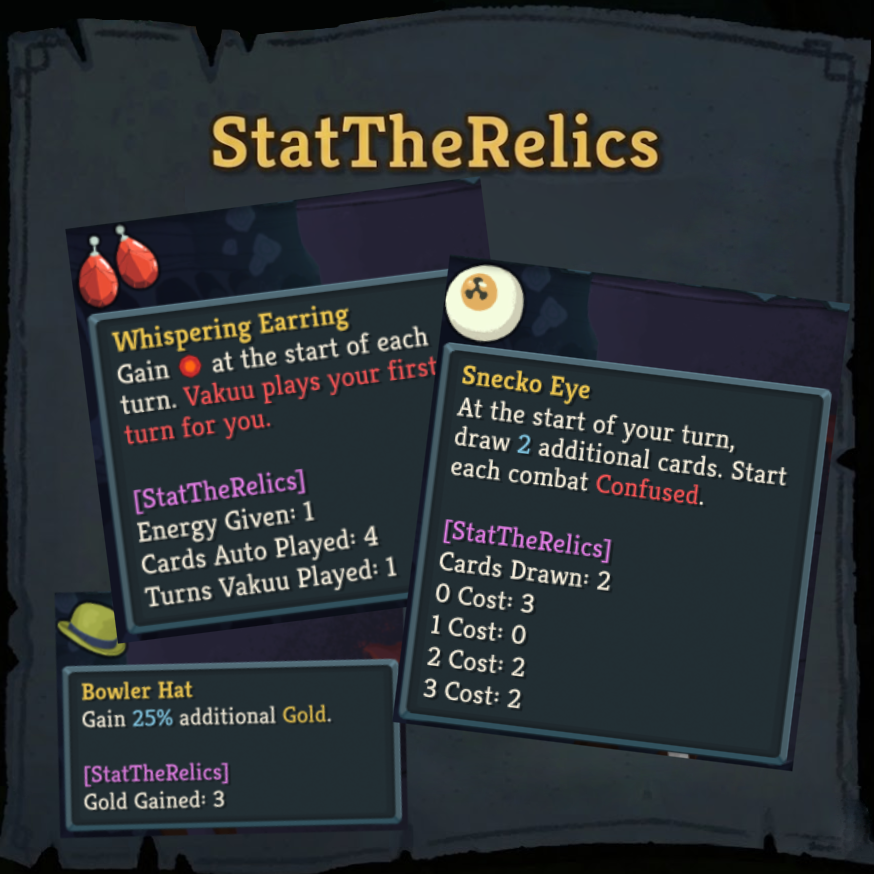

# Stat The Relics



Stat The Relics displays live and historical stat counters for relics in Slay the Spire 2. It patches relic tooltips to append usage data, then persists that data into run saves and run history.

Current version: `1.0.0`

Steam workshop link: https://steamcommunity.com/sharedfiles/filedetails/?id=3750161122

## Features

- Tracks per-relic counters, with relic-specific metrics for effects that are more interesting than simple flash counts.
- Appends formatted stats directly to relic tooltips during a run.
- Restores saved stats when viewing run history.
- Stores sidecar data with the current mod version, and hides stale stats when sidecar data was written by an incompatible version.

## Usage

Install the mod, start or continue a run, and hover a relic to see its tracked stats. Run-history views show the last saved snapshot with a small banner note.

Relic Collection and other compendium-style views intentionally do not show run-specific stats.

## Development

Add or tweak relic-specific formatting by editing a `BaseRelicStats` subclass under [RelicStats/Generated](./RelicStats/Generated) or [RelicStats](./RelicStats).

Dynamic patch hints live in `RelicTracker.RelicPatches` and include method name heuristics for obtains (`OnObtain`, `OnEquip`, constructors), effects (`Activate`, `OnUse`, setters), flashes, and tooltip builders.

The mod image source is [StatTheRelics.png](./StatTheRelics.png) at the repository root. Builds stage it into the generated Godot project as `StatTheRelics/mod_image.png`, so STS2 can load `res://StatTheRelics/mod_image.png` from the exported PCK.

## Build

Use:

```powershell
dotnet build
```

The build generates the Godot project metadata, exports the PCK, copies the DLL and manifest to the configured STS2 mod folder, and creates `StatTheRelics_v1.0.0.zip`.
