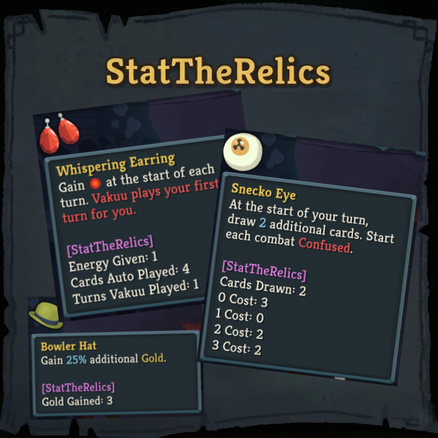

# Stat The Relics



Stat The Relics displays live and historical stat counters for relics in Slay the Spire 2. It appends usage data to relic tooltips and saves that data alongside run saves and run history.

Current version: `1.0.4`

[Steam Workshop page](https://steamcommunity.com/sharedfiles/filedetails/?id=3750161122)

## Features

- Tracks per-relic counters, including relic-specific effects that are more useful than simple activation counts.
- Appends formatted stats directly to relic tooltips during an active run.
- Restores saved stats when continuing a run or viewing run history.
- Follows the game's language automatically and supports community translation files.
- Stores the mod version and game build in each sidecar snapshot.
- Keeps older snapshots readable after a mod or game update by showing their stored JSON values under an archived-stats header.

## Installation

### Steam Workshop (recommended)

1. Subscribe on the [Steam Workshop page](https://steamcommunity.com/sharedfiles/filedetails/?id=3750161122) and wait for Steam to finish downloading it.
2. Launch Slay the Spire 2. If the game asks to load Mods or restart, accept the prompt.
3. Open the **Modding** screen from the main menu and make sure **Stat The Relics** is enabled. Restart the game if you changed its enabled state.
4. Start a new run, then hover a relic to see its counters.

This Mod is standalone and has no third-party Mod dependencies.

### Manual installation

Extract the release so the game directory contains the following layout. Do not place the release zip or the repository source tree directly inside `mods`.

```text
Slay the Spire 2/
└── mods/
    └── StatTheRelics/
        ├── StatTheRelics.dll
        ├── StatTheRelics.pck
        ├── mod_manifest.json
        ├── mod_image.png
        └── localization/
            └── eng.json
```

Avoid installing both the Workshop and manual copies at the same time; duplicate copies can make it unclear which version the game loaded.

## Usage and compatibility

Install and enable the Mod before starting the run whose statistics you want to track. It cannot reconstruct activations that happened before it was loaded, and old run-history entries created without the Mod have no Stat The Relics snapshot.

Run-history views display the last compatible saved snapshot. Relic Collection and other compendium-style views intentionally do not show run-specific stats.

Stat snapshots include the Mod version and game build. After an update, older snapshots remain readable under an archived-stats header and are displayed exactly as saved; new counters or renamed fields are not inferred retroactively.

Slay the Spire 2 is in active development and game updates can change its Mod API. The Workshop release targets the game's current main branch. Beta branches may temporarily be unsupported until the Mod is updated.

The game keeps modded and unmodded saves separately. Switching back to an unmodded launch can therefore show different progress; it does not mean that Stat The Relics deleted a save. Recent game versions copy unmodded progress when creating the modded save for the first time, as described in the official [Major Update #2 notes](https://steamcommunity.com/ogg/2868840/announcements/detail/710026912607505281).

## Troubleshooting

If no counters appear:

1. Confirm **Stat The Relics** is listed and enabled in the main-menu **Modding** screen, then restart the game.
2. Confirm Steam finished downloading the Workshop item and that no second manual copy is installed.
3. Test during an active run by hovering an owned relic; the Relic Collection screen intentionally shows no run counters.
4. If a tooltip has an archived-stats header, its values came from an older Mod or game version and are shown exactly as saved.
5. Use the game's main branch and update both the game and the Mod. A newly released game or beta update may require a matching Mod update.

## Translation

Translation files live under [localization](./localization). The Mod reads the game's current language code and switches files without requiring a restart.

See the [translation contribution guide](./localization/README.md) for every supported language code, file rules, and the contribution workflow.

## Development

Add or tweak relic-specific formatting by editing a `BaseRelicStats` subclass under [RelicStats/Generated](./RelicStats/Generated) or [RelicStats](./RelicStats).

Relic-specific behavior lives in one Harmony patch group per relic. Shared lifecycle hooks initialize zero-value counters when relics are obtained and provide the generic `Flashes` fallback for unknown or changed relic implementations.

The Mod image source is [StatTheRelics.png](./StatTheRelics.png) at the repository root. Builds stage it into the generated Godot project as `StatTheRelics/mod_image.png`, so STS2 can load `res://StatTheRelics/mod_image.png` from the exported PCK.

## Build

Create `local.props` in the project root:

```xml
<Project>
  <PropertyGroup>
    <!-- Paths -->
    <STS2GamePath>{Game Path}</STS2GamePath>
    <GodotExePath>{Godot.exe Path}</GodotExePath>

    <!-- Mod metadata -->
    <ModName>StatTheRelics</ModName>
    <ModDisplayName>Stat The Relics</ModDisplayName>
    <ModDescription>Displays stats for the various relics found in the spire</ModDescription>
    <ModAuthor>LeiT</ModAuthor>
    <ModVersion>1.0.4</ModVersion>
    <MinGameVersion>0.107.1</MinGameVersion>
  </PropertyGroup>
</Project>
```

Build with:

```powershell
dotnet build
```

The build generates the Godot project metadata, exports the PCK, copies the DLL, manifest, image, and localization files to the configured STS2 Mod folder, and creates `StatTheRelics_v{$version}.zip`.

## Game Update Checks

`tools/InspectRelics.csproj` validates Harmony targets and checks that every game relic has a generated stats definition. The versioned files under [Compatibility](./Compatibility) also fingerprint normalized relic IL, including async state machines, so implementation changes can be reviewed even when method signatures stay the same.
